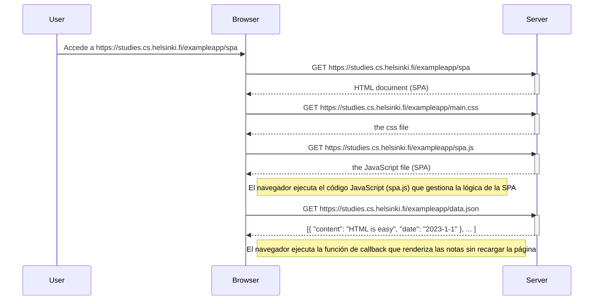

# Diagrama de Secuencia: Diagrama de aplicación de una sola página

```mermaid
sequenceDiagram
    participant User
    participant Browser
    participant Server

    User->>Browser: Accede a https://studies.cs.helsinki.fi/exampleapp/spa
    Browser->>Server: GET https://studies.cs.helsinki.fi/exampleapp/spa
    activate Server
    Server-->>Browser: HTML document (SPA)
    deactivate Server

    Browser->>Server: GET https://studies.cs.helsinki.fi/exampleapp/main.css
    activate Server
    Server-->>Browser: the css file
    deactivate Server

    Browser->>Server: GET https://studies.cs.helsinki.fi/exampleapp/spa.js
    activate Server
    Server-->>Browser: the JavaScript file (SPA)
    deactivate Server

    Note right of Browser: El navegador ejecuta el código JavaScript (spa.js) que gestiona la lógica de la SPA

    Browser->>Server: GET https://studies.cs.helsinki.fi/exampleapp/data.json
    activate Server
    Server-->>Browser: [{ "content": "HTML is easy", "date": "2023-1-1" }, ... ]
    deactivate Server

    Note right of Browser: El navegador ejecuta la función de callback que renderiza las notas sin recargar la página
```
