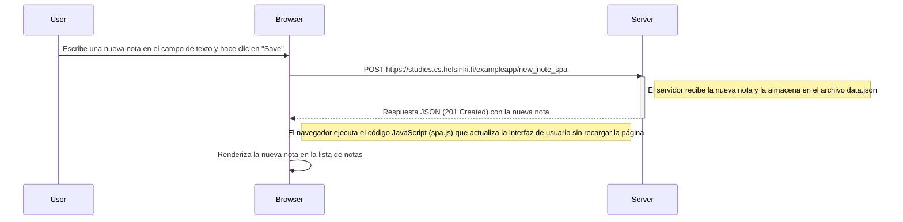

# Diagrama de Secuencia: Nueva nota en diagrama de aplicación de una sola página

```mermaid
sequenceDiagram
    participant User
    participant Browser
    participant Server

    User->>Browser: Escribe una nueva nota en el campo de texto y hace clic en "Save"
    Browser->>Server: POST https://studies.cs.helsinki.fi/exampleapp/new_note_spa
    activate Server
    Note right of Server: El servidor recibe la nueva nota y la almacena en el archivo data.json
    Server-->>Browser: Respuesta JSON (201 Created) con la nueva nota
    deactivate Server

    Note right of Browser: El navegador ejecuta el código JavaScript (spa.js) que actualiza la interfaz de usuario sin recargar la página

    Browser->>Browser: Renderiza la nueva nota en la lista de notas
```
